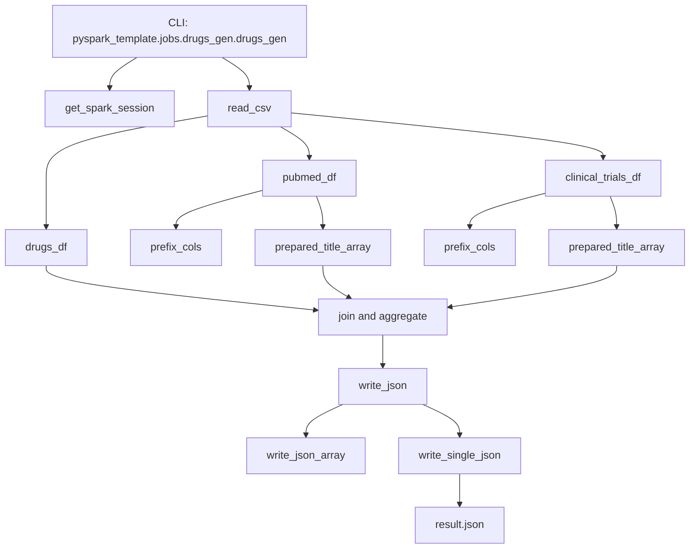
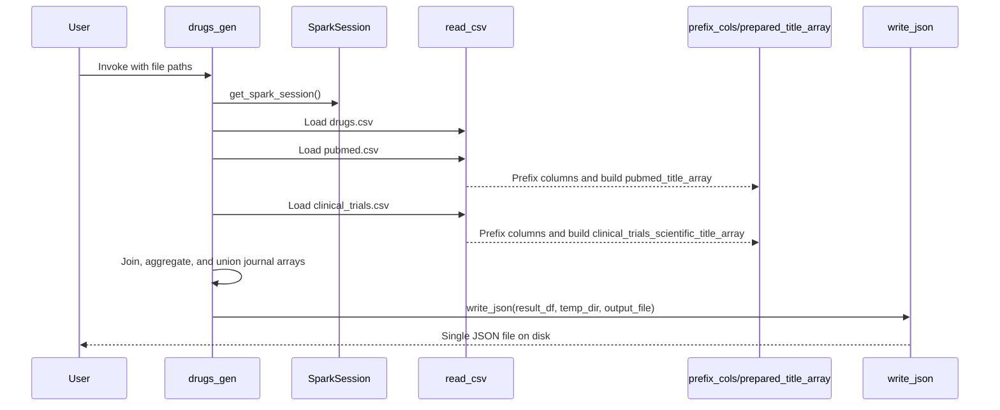

The codebase is intentionally small. Instead of a framework with registries or plugin hooks, it uses a linear job pipeline assembled from a few pure helpers and one CLI entry point. That simplicity is the main architectural decision: the repository demonstrates how to keep a PySpark project readable as it grows, not how to build an abstraction-heavy platform.

## Module Relationships

## Why The Project Is Split This Way

### One job module as the composition root

`pyspark_template/jobs/drugs_gen.py` is the place where orchestration happens. It owns the Click options, invokes the Spark session factory, reads all three datasets, applies transformations, performs joins and aggregations, and finally writes the result. Keeping orchestration in one module prevents the reusable helpers from becoming coupled to specific file paths or a fixed output layout.

### Helpers stay narrow and reusable

The reader layer in `pyspark_template/readers/csv.py` exposes a single function, `read_csv`, which is intentionally thin. The same pattern appears in `pyspark_template/transform/common.py`: `prefix_cols` renames columns, and `prepared_title_array` tokenizes titles for matching. These functions do one thing each, making them easy to test in isolation, as shown in `tests/transform/test_common.py`.

### Spark configuration is centralized

`pyspark_template/utils/spark.py` keeps Spark defaults out of the job code. `spark_conf_default` sets serializer, Arrow flags, shuffle partition count, and driver result limits. `get_spark_session` is decorated with `@lru_cache(maxsize=None)`, so repeated calls in a single Python process reuse the same `SparkSession`. That choice reduces boilerplate in scripts and notebooks.

### Output generation is separated from transformation logic

Spark writes JSON as partitioned output by default. The code in `pyspark_template/writers/json.py` adds a second stage: it serializes rows as JSON strings, groups them by partition, writes intermediate text files, then reads one generated file back into a single final JSON document and deletes the temporary directory. This is not the most scalable output strategy, but it is useful when downstream consumers expect one file rather than a directory tree.

## Data Lifecycle

The request lifecycle is data-centric rather than service-centric:

## Key Design Decisions Backed By Source

### Column prefixing avoids collisions during joins

The job joins datasets that all contain generic column names like `id`, `date`, and `journal`. In `pyspark_template/transform/common.py`, `prefix_cols` aliases every column to `"{prefix}_{name}"`. Without that step, the aggregate expressions in `drugs_gen.py` would be ambiguous, and the output field names would be much less explicit.

### Matching is token-based, not substring-based

The join condition uses `array_contains(f.col("pubmed_title_array"), f.upper(f.col("drug")))` and the equivalent field for clinical trials. That matters. The code does not perform fuzzy matching or regex extraction. It uppercases titles, splits on spaces, removes commas, then looks for exact token matches. This makes the behavior predictable, but it also means punctuation beyond commas or multi-token drug names need more work if the project expands.

### Outer join first, left join second

The PubMed join is `outer`, while the clinical trials join is `left`. The practical effect is visible in `data/output/result.json`: some drugs still appear with placeholder empty structs inside `clinical_trials` or `journals`. The job prioritizes keeping every drug from `data/drugs.csv` in the result even if no match exists downstream. That is useful for report completeness, but the output needs cleanup if consumers expect empty arrays instead of arrays containing `{}`.

### Tests focus on transformation correctness

There is one CLI test in `tests/jobs/test_drugs_gen.py`, but most behavioral precision lives in `tests/transform/test_common.py`. That distribution reflects the architecture: the transforms are the durable logic, while the CLI mostly composes existing pieces. If this template grows into multiple jobs, keeping transformation logic small and directly testable will matter more than adding layers around command dispatch.

## How The Pieces Fit Together

If you need to extend the project, the safest pattern is:

1. Add a new reader if the input format changes.
2. Add a transform if the normalization or matching rules change.
3. Keep the job module as the place where dataset-specific orchestration lives.
4. Reuse `get_spark_session` and the writer helpers unless you have a clear reason to replace them.

That keeps the same separation of concerns already encoded in the repository:

- `jobs/` composes
- `readers/` loads
- `transform/` normalizes
- `utils/` configures Spark
- `writers/` materializes output

The result is a template that is easy to read linearly from top to bottom, which is exactly what a small PySpark codebase should optimize for.
