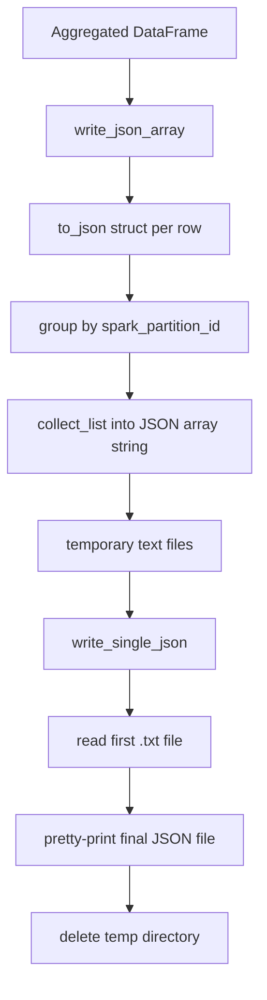

Spark's default JSON writer produces a directory full of partition files. This template intentionally adds a post-processing layer so the final artifact is one file such as `data/output/result.json`. That choice is central to how the repository behaves in local development.

## What This Concept Is

The output utilities live in `pyspark_template/writers/json.py`:

```python
from pyspark_template.writers.json import (
    write_json,
    write_json_array,
    write_json_array_pd,
    write_single_json,
)
```

With the exported signatures:

```python
def write_json_array(df: DataFrame, output_file: str) -> None

def write_json_array_pd(df: DataFrame, output_file: str) -> None

def write_single_json(json_dir: str, output_json: str) -> None

def write_json(df: DataFrame, path: str, output_file: str) -> None
```

Together they solve a practical problem: many consumers want a single document they can email, commit, or compare in tests. The CLI test in `tests/jobs/test_drugs_gen.py` depends on exactly that behavior when it compares a generated file to `data/output/result.json`.

## How It Relates To Other Concepts

- The [`drugs_gen` job](/docs/api-reference/jobs-drugs-gen) produces the aggregated DataFrame that these functions serialize.
- The title matching logic determines what nested structures appear in the arrays that get written.
- The Spark session configuration affects performance but not the output semantics of these writer helpers.

## How It Works Internally

`write_json_array` converts every row into a JSON string with `to_json(struct(*df.columns))`, groups those strings by Spark partition ID, collects them into an array, casts that array to a string, and writes the result as text files. In other words, it builds a JSON array representation within Spark.

`write_single_json` then walks the output directory, looks for `.txt` files that are not CRC files, reads one of them with Python's `json` module, and writes the parsed JSON back to the final output path with indentation. Finally, `write_json` deletes the temporary directory with `shutil.rmtree`.



## Basic Usage

This is the same pattern used by the CLI:

```python
from pyspark_template.writers.json import write_json

write_json(result_df, "journals.json", "data/output/result.json")
```

After the call completes, `data/output/result.json` is a single formatted JSON file, and the temporary `journals.json` directory has been removed.

## Advanced Usage

For debugging, you can stop before the final collapse and inspect the intermediate partition output:

```python
from pyspark_template.writers.json import write_json_array, write_single_json

write_json_array(result_df, "tmp/journals")
write_single_json("tmp/journals", "tmp/result.json")
```

That helps when you want to inspect the Spark-emitted text artifacts or compare them with the final pretty-printed JSON.

`write_json_array_pd` offers a second path:

```python
from pyspark_template.writers.json import write_json_array_pd

small_df = result_df.limit(10)
write_json_array_pd(small_df, "tmp/result-pandas.json")
```

This converts the DataFrame to Pandas and writes the records with `json.dump`. It is convenient for tiny datasets but should not be treated as the default path for large outputs.

## Trade-Offs

<Accordions>
<Accordion title="Single output file vs native Spark partitioned output">
Writing one JSON file is useful for local inspection, snapshot tests, and handoff to systems that do not understand Spark partition directories. That is why the template uses this pattern instead of a plain `df.write.json(...)`. The trade-off is scalability: both `collect_list` by partition and the later Python-side file read assume a relatively small final dataset.

For large pipelines, the native partitioned layout is more operationally sound, even if it is less convenient for humans. The template chooses ergonomics over scale because the sample output is deliberately small and easy to compare in source control.
</Accordion>
<Accordion title="Spark-native serialization vs Pandas conversion">
`write_json_array` keeps the conversion inside Spark until the final file rewrite, so it is the safer general-purpose path. `write_json_array_pd` is shorter and can be easier to reason about for tiny results because it goes straight through `df.toPandas().to_dict(orient="records")`. The downside is memory pressure on the driver, because the entire DataFrame must fit in local memory before writing.

Use the Pandas path only when you know the dataset is small enough to materialize safely. In other cases, keep the serialization in Spark and treat the final Python rewrite as a formatting step rather than the main transport path.
</Accordion>
</Accordions>

<Callout type="warn">`write_single_json` picks files by extension and reads the first matching `.txt` file it encounters in the temporary directory. That is acceptable when the upstream `groupBy(spark_partition_id())` produces one array per partition and the final dataset is small, but it is not a robust distributed output protocol for large or highly partitioned jobs.</Callout>

## What To Improve If You Extend This

There are three obvious next steps if this template becomes a production pipeline:

1. Filter empty structs out of `pubmeds`, `clinical_trials`, and `journals` before writing.
2. Replace the single-file collapse step with a more explicit coalesce or a partition-aware export strategy.
3. Add schema validation around the final JSON artifact so consumers can detect malformed or partial output.

For the exact parameter tables and import paths, continue to the [`writers-json` API page](/docs/api-reference/writers-json).
