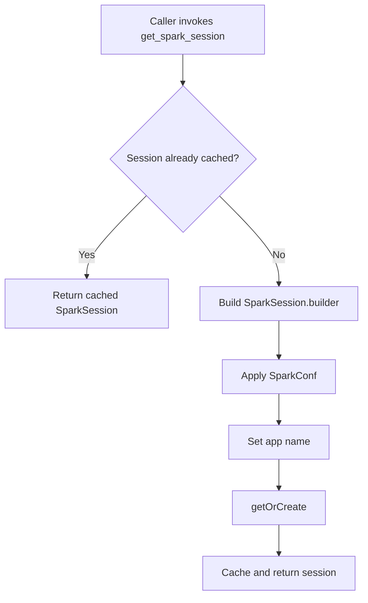

The Spark session layer is the foundation of the project. Everything else assumes a valid `SparkSession` exists, but the template deliberately avoids constructing it inline in every script. Instead, `pyspark_template/utils/spark.py` provides one configuration factory and one cached session factory.

## What This Concept Is

The public API is:

```python
from pyspark_template.utils.spark import (
    DEFAULT_MAX_RESULT_SIZE,
    DEFAULT_SHUFFLE_PARTITIONS,
    get_spark_session,
    spark_conf_default,
)
```

With these signatures:

```python
DEFAULT_SHUFFLE_PARTITIONS: str = "24"
DEFAULT_MAX_RESULT_SIZE: str = "0"

def spark_conf_default(
    shuffle_partitions: str = DEFAULT_SHUFFLE_PARTITIONS,
) -> SparkConf

def get_spark_session(
    spark_conf: SparkConf = spark_conf_default(),
) -> SparkSession
```

The problem it solves is repetitive setup. In many PySpark repos, every notebook and every job rebuilds the same `SparkSession.builder` chain. This template moves those defaults into one module so the rest of the code can stay focused on business logic.

## How It Relates To Other Concepts

- The [`drugs_gen` job](/docs/api-reference/jobs-drugs-gen) calls `get_spark_session()` before doing any work.
- The title matching transforms in [`transform/common.py`](/docs/api-reference/transform-common) assume they will receive DataFrames from a valid Spark session.
- The JSON writer helpers rely on Spark SQL functions such as `to_json`, `struct`, and `spark_partition_id`, which only exist once the session has been created.

## How It Works Internally

`spark_conf_default` creates a `SparkConf` and sets four behaviors that shape the rest of the project:

- `spark.driver.maxResultsSize` is set to `"0"`, which disables the driver result size cap.
- `spark.sql.shuffle.partitions` defaults to `"24"`.
- `spark.serializer` is set to Kryo for more efficient serialization.
- Arrow execution and Arrow fallback are both enabled for PySpark.

`get_spark_session` then uses that configuration to build a `SparkSession`, sets the app name to `"pyspark_template_app"`, and caches the result with `@lru_cache(maxsize=None)`. That means repeated calls inside the same interpreter return the same session object instead of opening multiple sessions.



## Basic Usage

This is the standard pattern for a script or notebook cell:

```python
from pyspark_template.utils.spark import get_spark_session

spark = get_spark_session()
print(spark.sparkContext.appName)
```

Expected output:

```text
pyspark_template_app
```

## Advanced Usage

If a job needs fewer shuffle partitions for a small local run, create a custom `SparkConf` first:

```python
from pyspark_template.utils.spark import get_spark_session, spark_conf_default

conf = spark_conf_default(shuffle_partitions="4")
spark = get_spark_session(conf)

print(spark.conf.get("spark.sql.shuffle.partitions"))
```

Expected output:

```text
4
```

Be aware that `get_spark_session` is cached. The first call wins for the lifetime of the process unless you explicitly clear the cache or restart the interpreter.

<Callout type="warn">Call `get_spark_session` with your custom configuration before any other code creates the default session. Because the function is wrapped in `@lru_cache`, a prior call such as `get_spark_session()` in a notebook cell will cause later custom calls to reuse the original session instead of applying the new settings.</Callout>

## Trade-Offs

<Accordions>
<Accordion title="Centralized defaults vs per-job flexibility">
Centralizing Spark configuration in `pyspark_template/utils/spark.py` removes repeated builder code and makes the default runtime easy to reason about. That is a good fit for a template repository where most jobs should share the same serializer and Arrow settings. The trade-off is that configuration becomes slightly less explicit at the call site, because `drugs_gen.py` only shows `get_spark_session()` and not the settings being applied. If you add several jobs with materially different performance profiles, you may want a job-specific wrapper such as:

```python
spark = get_spark_session(spark_conf_default(shuffle_partitions="200"))
```

That pattern preserves the shared defaults while still giving a high-volume job room to diverge. It also makes the override visible in the calling module, which is valuable when you are tuning specific workloads.
</Accordion>
<Accordion title="Caching the session vs recreating it for isolation">
Caching saves startup time and prevents accidental creation of multiple local sessions in notebooks or tests. That improves ergonomics, especially when using the project interactively. The cost is hidden global state: once a session exists, later calls cannot safely assume they control the configuration.

In test suites or long-lived notebook kernels, explicit cleanup or cache invalidation may be necessary if you need strict isolation between runs. The template accepts that trade because it optimizes first for simple local development, not for concurrent session management.
</Accordion>
</Accordions>

## Pitfalls To Watch For

- `DEFAULT_MAX_RESULT_SIZE = "0"` removes the driver cap. That is acceptable for a small template, but it can mask collection problems in larger jobs.
- The utility does not set a Spark master directly. In local development, the README expects environment variables such as `SPARK_HOME` to already be configured.
- The tests in `tests/conftest.py` create their own local session instead of using `get_spark_session`, which is a sign that test isolation matters once you move beyond this sample job.

For the full signatures and parameter tables, continue to the [`utils-spark` API page](/docs/api-reference/utils-spark).
