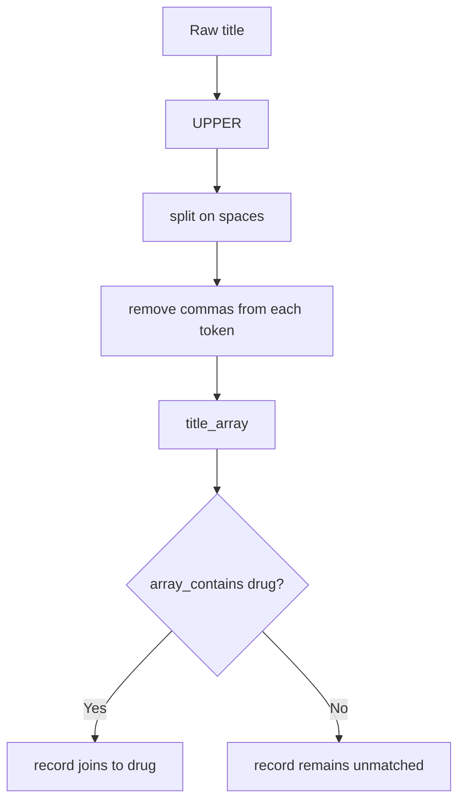

The core business rule in this repository is simple: a drug is associated with a PubMed article or clinical trial when the drug name appears as an uppercase token in the title. Everything else in the pipeline exists to support that rule.

## What This Concept Is

The matching utilities live in `pyspark_template/transform/common.py`:

```python
from pyspark_template.transform.common import prefix_cols, prepared_title_array
```

With the exact signatures:

```python
def prefix_cols(df: DataFrame, prefix: str) -> DataFrame

def prepared_title_array(df: DataFrame, title: str) -> DataFrame
```

`prefix_cols` solves the collision problem. The source datasets use overlapping field names such as `id`, `date`, and `journal`, so joins would produce ambiguous columns without renaming. `prepared_title_array` solves the tokenization problem. It adds a new array column containing normalized uppercase tokens from a title field so the job can use `array_contains` in join conditions.

## How It Relates To Other Concepts

- The [`Spark Session`](/docs/spark-session) concept provides the DataFrame runtime.
- The [`drugs_gen` orchestration](/docs/api-reference/jobs-drugs-gen) depends on prefixed columns to build predictable output structs.
- The [`JSON output`](/docs/json-output) concept depends on the aggregation stage producing stable nested arrays after matching.

## How It Works Internally

The logic in `prepared_title_array` is short but important:

1. Uppercase the selected title column.
2. Split the string on spaces into an array.
3. Run `transform` over that array.
4. Remove commas from each token with `regexp_replace`.

That yields values such as `["HELLO", "WORLD", "IS", "BEAUTIFUL"]`, which is exactly what `tests/transform/test_common.py` asserts.

The join code in `pyspark_template/jobs/drugs_gen.py` then uses:

```python
f.array_contains(f.col("pubmed_title_array"), f.upper(f.col("drug")))
```

and

```python
f.array_contains(
    f.col("clinical_trials_scientific_title_array"),
    f.upper(f.col("drug")),
)
```

So the workflow is deterministic: normalize source titles, uppercase the drug value, and perform exact token membership checks.



## Basic Usage

This example mirrors the unit test and is useful when you want to understand the transform in isolation:

```python
from pyspark_template.transform.common import prepared_title_array

df = spark.createDataFrame(
    [(1, "hello, world is beautiful")],
    ["id", "title"],
)

prepared = prepared_title_array(df, "title")
prepared.select("title_array").show(truncate=False)
```

Expected output:

```text
+------------------------------+
|title_array                   |
+------------------------------+
|[HELLO, WORLD, IS, BEAUTIFUL] |
+------------------------------+
```

## Advanced Usage

The typical production usage chains prefixing and tokenization together so the resulting DataFrame is safe to join:

```python
from pyspark_template.readers.csv import read_csv
from pyspark_template.transform.common import prefix_cols, prepared_title_array

pubmed_df = (
    read_csv(spark, "data/pubmed.csv")
    .transform(lambda df: prefix_cols(df, "pubmed"))
    .transform(lambda df: prepared_title_array(df, "pubmed_title"))
)

pubmed_df.select("pubmed_id", "pubmed_title_array").show(truncate=False)
```

This produces arrays such as `["DIPHENHYDRAMINE", "HYDROCHLORIDE", "HELPS", ...]`, which the job can join against the uppercase values from `data/drugs.csv`.

## Trade-Offs

<Accordions>
<Accordion title="Exact token matching vs fuzzy or substring matching">
Exact token matching is easy to explain and easy to test. It also avoids many false positives that appear when you use substring checks, especially with short drug names. The trade-off is recall: punctuation other than commas, possessives, and multi-word drug names are not handled by this transform.

If you later need broader matching, you will likely replace `split(..., " ")` with a regex tokenizer and add more normalization rules before calling `array_contains`. That would improve coverage, but it would also make the matching rules harder to reason about and harder to verify in small unit tests.
</Accordion>
<Accordion title="Prefixing columns up front vs selecting only needed fields">
Prefixing every column makes downstream code explicit because output fields such as `pubmed_title` and `clinical_trials_journal` carry their origin in the name. That reduces ambiguity inside aggregate expressions and nested structs. The cost is verbosity and slightly wider schemas, especially if the source files gain more columns over time. An alternative is to project only the required columns immediately after reading:

```python
pubmed_df = read_csv(spark, "data/pubmed.csv").select("id", "title", "date", "journal")
```

This is leaner, but then every job has to re-declare the projection rules itself. The template prefers prefixing because it keeps provenance obvious all the way to the nested output structs.
</Accordion>
</Accordions>

<Callout type="warn">`prepared_title_array` removes commas only. Titles containing periods, semicolons, slashes, or non-ASCII punctuation can still produce tokens that do not equal the uppercase drug name. The sample data shows this risk through values like `Journal of emergency nursing\xc3\x28` and `Hôpitaux Universitaires de Genève` in downstream output.</Callout>

## Practical Implications

The result format in `data/output/result.json` shows both the strength and the limitations of the current approach:

- `EPINEPHRINE` matches both PubMed and clinical trial titles successfully.
- `BETAMETHASONE` matches a clinical trial even though there is no PubMed match.
- Drugs with no title hit still remain in the output because the job groups by the original drug list.

That makes the transform layer the main extension point if the repository evolves. If you want better matching quality, this is the module to change first.
